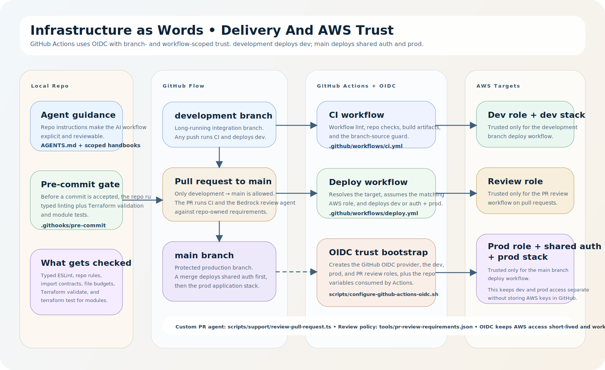

# Infrastructure as Words

This repo is my take-home submission for the CVS team. It is a real internal
platform-style tool: a signed-in user describes the infrastructure they want,
the system generates a governed Terraform starter, saves a zip artifact,
records the run in AWS, and shows the resulting architecture as a live diagram.

It also covers the DevOps side of the challenge directly: Terraform modules and
tests, GitHub Actions CI/CD, GitHub-to-AWS OIDC trust, a custom AI PR review
agent, local pre-commit guardrails, shared auth, and CloudWatch observability.

## What This Covers From The Ask

- AI-native development workflow:
  [`AGENTS.md`](./AGENTS.md),
  [AI usage guide](./docs/for-graders/ai-usage.md),
  [AI PR review workflow](./.github/workflows/pr-review.yml)
- Terraform + CI/CD:
  [`infra/modules/`](./infra/modules),
  [Terraform roots](./infra/terraform),
  [deploy workflow](./.github/workflows/deploy.yml)
- Platform service:
  [`services/api/`](./services/api),
  [`web/`](./web),
  shared Cognito auth, DynamoDB history, S3 artifacts, Bedrock generation
- Operational maturity:
  CloudWatch logs, alarms, dashboards, SNS notifications, branch protection,
  branch-based promotion, and local pre-commit checks

## Try It

- `prod app`: [infrastructure-as-words.com](https://infrastructure-as-words.com)
- `dev app`: [dev.infrastructure-as-words.com](https://dev.infrastructure-as-words.com)
- `shared auth`: [auth.infrastructure-as-words.com](https://auth.infrastructure-as-words.com)

Sign in with the tester credentials provided separately, enter an infrastructure
request, and let the app generate:

- a diagram
- a Terraform zip artifact
- a saved history record with timestamps, cost, and status

If you want a quick prompt to try, use:

> Private customer platform with shared auth, an API, durable storage, audit history, and observability.

## Diagrams

### Runtime architecture


### Delivery and AWS trust



The editable draw.io source for the platform diagram lives at
[`diagrams/infrastructure-as-words-platform.drawio.xml`](./diagrams/infrastructure-as-words-platform.drawio.xml).

## Why I Chose This Shape

- `Lambda + API Gateway`
  The service is request-driven and bursty. Lambda keeps the operational surface
  small while still letting me package a real typed backend.
- `S3 + CloudFront for the frontend`
  The UI is a static Next.js export. Hosting it as immutable assets is cheap,
  simple, and easy to promote across environments.
- `Shared Cognito domain`
  Both environments use the same hosted auth domain, which keeps auth behavior
  consistent and avoids duplicating auth infrastructure unnecessarily.
- `DynamoDB + S3`
  DynamoDB stores run metadata, governance settings, and budget state. S3 stores
  the generated zip artifacts. The split keeps history queries fast and artifact
  storage cheap.
- `SSM Parameter Store`
  Sensitive runtime values stay out of source control and out of GitHub secrets
  where they do not belong. Lambda reads the admin email allowlist path at
  runtime.
- `GitHub Actions + OIDC`
  I did not want long-lived AWS credentials in GitHub. Instead, GitHub Actions
  assumes short-lived roles through the GitHub OIDC provider, with trust scoped
  to specific branches and workflows.
- `A long-running development branch`
  `development` is the always-on integration branch that auto-deploys `dev`.
  `main` is protected and promotes only after review. That gives a stable demo
  environment and a deliberate production path.
- `A repo-owned AI PR reviewer`
  The PR review agent uses a committed requirements file, so the review policy
  lives with the code instead of living in someone’s head.
- `Pre-commit guardrails`
  Typed linting plus Terraform validation and module tests run before a commit is
  accepted. That catches a lot of avoidable mistakes before CI even starts.

## DevOps Choices In Code

- `GitHub -> AWS OIDC bootstrap`
  [`scripts/configure-github-actions-oidc.sh`](./scripts/configure-github-actions-oidc.sh)
  creates the GitHub OIDC provider, the branch-bound IAM roles, and the repo
  variables consumed by Actions.
- `CI and branch guard`
  [`.github/workflows/ci.yml`](./.github/workflows/ci.yml)
- `Deploy pipeline`
  [`.github/workflows/deploy.yml`](./.github/workflows/deploy.yml)
- `AI PR reviewer`
  [`.github/workflows/pr-review.yml`](./.github/workflows/pr-review.yml),
  [`scripts/support/review-pull-request.ts`](./scripts/support/review-pull-request.ts),
  [`tools/pr-review-requirements.json`](./tools/pr-review-requirements.json)
- `Local git hook`
  [`.githooks/pre-commit`](./.githooks/pre-commit),
  [`scripts/setup-git-hooks.mjs`](./scripts/setup-git-hooks.mjs)
- `Terraform module tests`
  [`infra/modules/submission-data/submission-data.tftest.hcl`](./infra/modules/submission-data/submission-data.tftest.hcl),
  [`infra/modules/cognito-web-client/cognito-web-client.tftest.hcl`](./infra/modules/cognito-web-client/cognito-web-client.tftest.hcl)

## Where To Look

- `web/`
  Signed-out landing, signed-in workspace, history table, React Flow diagram,
  and admin UI
- `services/api/src/lambda.ts`
  API entrypoint, routing, validation, auth gating, and structured logging
- `services/api/src/generation-service.ts`
  Async generation orchestration, artifact packaging, and persistence flow
- `services/api/src/bedrock-generator.ts`
  Prompt construction, Bedrock invocation, normalization, and model cost usage
- `infra/modules/`
  Reusable Terraform modules used by the deployment roots
- `infra/terraform/` and `infra/terraform-auth/`
  Environment roots for app stacks and shared auth
- `docs/for-graders/`
  Reviewer-facing notes on AI usage and release flow

## Branch And Deployment Model

- Push to `development`:
  run CI and deploy the `dev` environment
- Pull request from `development` to `main`:
  run CI plus the Bedrock PR review agent
- Push to `main`:
  deploy shared auth and then deploy `prod`

This gives the repo a long-running development environment without weakening the
production promotion path.

## Local Setup

```bash
npm install --include-workspace-root --workspaces
npm run check
```

`npm install` runs `prepare`, which applies the repo-managed git hook setup by
pointing `core.hooksPath` at `.githooks`.

Useful commands:

```bash
npm run hooks:install
npm run test:critical
npm run validate:infra
npm run deploy:auth
DEPLOY_ENV=dev npm run deploy:env
DEPLOY_ENV=prod npm run deploy:env
```

## Submission Notes

- AI workflow and reviewer map:
  [docs/for-graders/ai-usage.md](./docs/for-graders/ai-usage.md)
- Branch model and promotion flow:
  [docs/for-graders/release-flow.md](./docs/for-graders/release-flow.md)
- Diagram assets:
  [diagrams/README.md](./diagrams/README.md)
