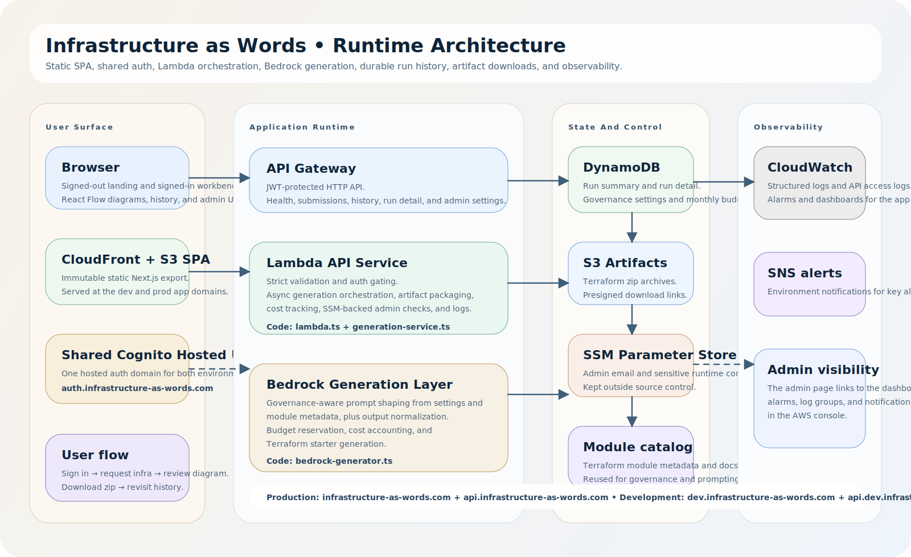

# Infrastructure as Words

Infrastructure as Words is a static Next.js front end paired with an AWS Lambda
API. Users authenticate through a Cognito Hosted UI custom domain, describe
infrastructure in plain language, and revisit their timestamped submission
history later.

## Architecture Diagram



The editable source is committed at
`diagrams/infrastructure-as-words-platform.drawio.xml`.

## Repo layout

- `web/` contains the exported Next.js application.
- `services/api/` contains the typed Lambda handler and DynamoDB repository.
- `packages/contracts/` contains shared schemas and response types.
- `infra/terraform/` and `infra/terraform-auth/` are environment roots that
  compose reusable modules.
- `infra/modules/` contains reusable Terraform modules, metadata, and module
  tests (`*.tftest.hcl`).
- `infra/config/` contains the typed environment source of truth.

## Commands

```bash
npm install --include-workspace-root --workspaces
npm run build:shared
npm run lint:type
npm run typecheck
npm run test:critical
npm test
npm run test:watch
npm run check
npm run build:all
npm run validate:infra
npm run deploy:auth
DEPLOY_ENV=dev npm run deploy:env
npm run deploy:all
```

## Submission docs

- `AGENTS.md` documents the repo-level AI agent workflow and scoped handbooks.
- `docs/for-graders/ai-usage.md` explains how AI was used in development and in
  the product itself.

## Environments

- `dev` deploys `dev.infrastructure-as-words.com`,
  `api.dev.infrastructure-as-words.com`, and uses the shared auth domain
  `auth.infrastructure-as-words.com`
- `prod` deploys `infrastructure-as-words.com`,
  `api.infrastructure-as-words.com`, and uses the shared auth domain
  `auth.infrastructure-as-words.com`

## GitHub Actions

- `.github/workflows/ci.yml` runs workflow linting, `npm run check`, and
  `npm run build:all` for pull requests and pushes to `dev` and `prod`.
- `.github/workflows/pr-review.yml` runs on pull requests, uses Bedrock to
  review the diff against repo-owned requirements from
  `tools/pr-review-requirements.json`, then updates a PR comment with findings.
- `.github/workflows/deploy.yml` is branch-aware:
  - pushes to `dev` build once and deploy the `dev` environment
  - pushes to `prod` build once, deploy shared auth, then deploy `prod`
- Manual deploys support `all`, `auth`, `prod`, and `dev` targets.

## Branch Flow

- `dev` is the integration branch and deploys the `dev` environment on push.
- `prod` is the production branch and deploys shared auth plus the `prod`
  environment on push.
- Pull requests run both the standard CI checks and the Bedrock-powered review
  lane.

## GitHub Deploy Setup

- Run `./scripts/configure-github-actions-oidc.sh` once from a workstation that
  has AWS and GitHub CLI access. It creates or updates the GitHub OIDC provider,
  the branch-specific deploy/review IAM roles, and the repository variables the
  workflows use.
- Configure GitHub Actions to use AWS OIDC and set the repository or
  organization variables `AWS_DEPLOY_ROLE_ARN_DEV`,
  `AWS_DEPLOY_ROLE_ARN_PROD`, and `AWS_REVIEW_ROLE_ARN`.
- The deploy role must trust
  `arn:aws:iam::<account-id>:oidc-provider/token.actions.githubusercontent.com`
  and allow `sts:AssumeRoleWithWebIdentity` for the exact branch and workflow
  file that will use it.
- The deploy role needs Terraform apply access to the services managed by this
  repo: ACM, API Gateway, CloudFront, Cognito, DynamoDB, IAM, Lambda, Route53,
  S3, and STS.
- The review role needs `bedrock:InvokeModel` access to the configured review
  model plus permission to assume the role through GitHub OIDC.
